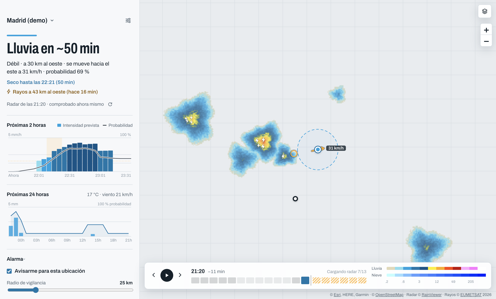

# Chubasco — alarma de lluvia para escritorio

App de escritorio para **macOS y Windows** que vigila el radar de lluvia en tus ubicaciones y te avisa antes de que llegue el agua. Tiene **widget de escritorio** y una **versión web** que se puede insertar en otras páginas. Está inspirada en [rain-alarm.com](https://www.rain-alarm.com/), pero hace varias cosas que la web no hace.



## Qué mejora respecto a rain-alarm.com

| | rain-alarm.com (web) | Chubasco |
|---|---|---|
| Vigilancia en segundo plano | Solo con la pestaña o la app móvil abiertas | Vive en la barra de menú (Mac) o en la bandeja (Windows) y avisa con la ventana cerrada. Un clic en el icono abre un **mini panel** con el estado, la ventana seca y la gráfica de 2 h. Puede abrirse al iniciar sesión |
| Previsión del radar | Fotogramas pasados | Calcula **dirección, velocidad y hora de llegada** comparando los últimos fotogramas, con movimiento distinto por zonas. Da una **probabilidad** («lluvia en ~20 min, 70 %, entre 15 y 25») y muestra la previsión animada hasta +60 min sobre el mapa |
| Previsión combinada | — | Una sola curva: radar al principio y modelo después, con paso gradual. De ahí sale la **ventana seca** («seco hasta las 22:30», «para hacia las 21:40; después, seco hasta…») |
| Avisos | Lluvia dentro de un radio | Lluvia en el radio, lluvia inminente («en ~15 min», con la probabilidad mínima que elijas), empieza y deja de llover, aviso del modelo, **rayos cerca**, **tormenta fuerte** (posible granizo), **resumen diario** y **«avísame cuando pare»** (cuando haya al menos 15, 30 o 60 min secos). Incluye anti-spam, horas de silencio y «posponer» desde la bandeja. Opcionalmente, también **en el móvil** con ntfy |
| Trayectos | — | Casa → trabajo a las 8:15 de lunes a viernes: media hora antes te dice si lloverá en el camino (en qué tramo) y, si salir algo antes o después mejora mucho, a qué hora |
| Rayos | De pago | Actividad eléctrica vista por el satélite Meteosat-12 (Europa y África): iconos de rayo blancos en el mapa (más tenues cuanto más antiguos) y aviso si hay rayos cerca |
| Precisión | — | La app **se autoevalúa**: compara cada previsión con lo que el radar ve después y muestra aciertos, falsas alarmas y error de la hora de llegada de cada ubicación. Con datos suficientes **se calibra sola** |
| Ubicaciones | Una | Varias (casa, trabajo…), cada una con su radio y su intensidad mínima, y una opcional «Aquí» que sigue al equipo |
| Previsión del modelo | De pago | Gratis: precipitación cada 15 min (2 h) y por horas (24 h) de Open-Meteo |
| Mapas claro, oscuro y callejero | De pago | Incluidos (OpenFreeMap, sin clave), con las etiquetas del mapa por encima del radar |
| Widget | — | **Widget de escritorio** (Mac y Windows) en tres tamaños, que se queda donde lo pongas, y **widget para insertar en cualquier web** con un `<iframe>` |
| Web | La propia web | **Versión web** con la misma interfaz y el mismo análisis, que funciona también en el móvil |
| Otros | — | Historial de avisos, eco más cercano y flecha de movimiento en el mapa, mm/h o in/h, km o mi, español e inglés, atajos de teclado, sin cuentas ni anuncios |

Hay una limitación honesta. Con datos de radar gratuitos solo se distingue **lluvia y nieve**: granizo y lluvia helada no se distinguen (el aviso de tormenta fuerte es una señal, no un detector de granizo). Además, en zonas sin cobertura de radar el mapa queda vacío. Ahí conviene activar «El modelo prevea lluvia en la próxima hora».

## Instalar y ejecutar

Requisitos: [Node.js](https://nodejs.org/) 20 o superior y unos **600 MB libres**. Electron ocupa unos 350 MB dentro de `node_modules`.

```bash
git clone https://github.com/lalesena/chubasco.git
cd chubasco
npm install
node node_modules/electron/install.js   # npm 11 ya no ejecuta solo el instalador de Electron
npm start          # abre la app
npm run demo       # datos simulados: una línea de tormentas que avanza hacia Madrid
npm test           # pruebas del análisis del radar y de los avisos
```

### Crear la app instalable

```bash
npm run dist:mac   # en un Mac: dist/*.dmg y *.zip (Apple Silicon e Intel, firma ad hoc)
npm run dist:win   # en Windows: dist/Chubasco-Setup-*.exe (desde un Mac con Apple Silicon necesita Rosetta)
```

- **En Mac:** abre el `.dmg` y arrastra Chubasco a *Aplicaciones*.
  - Como no lleva certificado de Apple, la primera vez haz clic derecho → *Abrir*.
  - Si macOS sigue negándose, ejecuta `xattr -cr /Applications/Chubasco.app`.
- **En Windows:** si SmartScreen avisa, pulsa *Más información* → *Ejecutar de todas formas*.

### Publicar en GitHub y actualizaciones

El repositorio es `lalesena/chubasco` (configurado en `repository.url` y `build.publish` de `package.json`).

1. En GitHub, crea un repositorio público **vacío** llamado `chubasco` (sin README, licencia ni `.gitignore`, para que no choque con el historial que ya hay aquí).
2. Sube el código: `git push -u origin main` (el remoto `origin` ya apunta a `https://github.com/lalesena/chubasco.git`).
3. Para publicar una versión: `npm version patch` (o `minor`) y `git push --follow-tags`.

El flujo `.github/workflows/build.yml` hace, en macOS y en Windows:

- **En cada push:** las pruebas y una prueba de humo de la app en modo demostración, con capturas de la ventana y del mini panel (se pueden descargar desde la pestaña *Actions*).
- **Con una etiqueta `v*`:** además compila los instaladores y los publica en *Releases*.

Desde ahí se actualiza la app: en **Windows** se descarga sola y se instala al cerrarla; en **Mac** avisa y abre la página de descarga (instalarse sola requiere un certificado «Developer ID» de Apple, de pago). Si añades los secretos `CSC_LINK` y `CSC_KEY_PASSWORD`, firma con tu certificado.

## Widget de escritorio

Actívalo en *Ajustes → Widget de escritorio* o desde el menú del icono de la barra (*Widget en el escritorio*).

- Arrástralo desde cualquier punto. Un clic sin arrastrar abre Chubasco en esa ubicación.
- Con el clic derecho (o el botón «⋯» que aparece al pasar el ratón) eliges el tamaño, la ubicación (la seleccionada en la app o una fija) y si va siempre encima de las ventanas.
- **Pequeño:** estado, una línea y la gráfica de 2 h. **Mediano:** además, rayos, tormenta o ventana seca. **Grande:** todo, más las demás ubicaciones (o las próximas 24 h si solo hay una).
- En macOS usa el fondo translúcido del sistema y aparece en todos los escritorios. En Windows no sale en la barra de tareas ni en Alt+Tab.

No es un widget del sistema (el centro de notificaciones de macOS o el panel de widgets de Windows 11): esos exigen apps nativas aparte en Swift y en C#. Es una ventanita de la propia app, la misma en los dos sistemas.

## Versión web y widget para otras webs

`npm run build:web` genera en `web/dist` una web estática con la misma interfaz y el mismo análisis que la app. El análisis se hace en el navegador de cada visitante, dentro de un *Web Worker*, sin servidor propio.

- **`index.html`:** la app completa, adaptada al móvil. Las ubicaciones se guardan en el navegador.
- **`embed.html`:** el widget para insertar en otras webs. Se configura con la dirección: `embed.html?lat=40.4168&lon=-3.7038&name=Madrid&size=medium&theme=auto&lang=es`. Al pulsarlo se abre la versión web en ese lugar.
- **Botón `</>` («Insertar en tu web»):** elige ubicación, tamaño, tema e idioma, muestra la vista previa y da el código para copiar:

  ```html
  <iframe src="https://lalesena.github.io/chubasco/embed.html?lat=40.4168&amp;lon=-3.7038&amp;name=Madrid&amp;size=medium"
          width="360" height="184" style="border:0;border-radius:16px;max-width:100%" loading="lazy" title="Chubasco · Madrid"></iframe>
  ```

Lo que **no** tiene la web, respecto a la app: los avisos solo llegan con la página abierta (no hay servidor de avisos), y no hay avisos en el móvil, trayectos, resumen diario, «avísame cuando pare», autoevaluación ni filtro de ecos fijos (necesitan días de datos guardados). Tampoco hay ubicación por IP: «Seguir mi ubicación» usa la del navegador.

**Probarla en tu ordenador:** `npm run build:web` y después `python3 -m http.server -d web/dist 8000`. Abre http://localhost:8000.

**Publicarla gratis en GitHub Pages:** con el repositorio ya en GitHub (ver arriba), ve a *Settings → Pages → Source* y elige **GitHub Actions**. Desde entonces, `.github/workflows/pages.yml` la publica en cada push a `main`, en `https://lalesena.github.io/chubasco/`.

**Antes de anunciarla en público, pregunta a RainViewer.** Su API gratuita es «para uso personal o educativo», y una web abierta con widgets insertados en otras páginas puede no entrar ahí. Escríbeles a support@rainviewer.com explicando el proyecto (gratis, sin anuncios, con atribución visible) y espera su respuesta. Open-Meteo, EUMETSAT y OpenFreeMap sí lo permiten con atribución, que la web y el widget ya muestran. La web incluye un aviso de privacidad (`privacidad.html`).

## Cómo funciona

1. **Radar:** RainViewer publica un fotograma cada 10 minutos. Por cada ubicación se descargan los cuatro últimos alrededor del punto (tiles de 512 px a zoom 6, ≈1 km por píxel). Cada color se traduce a dBZ con la paleta oficial «Universal Blue» y de dBZ a mm/h con Marshall-Palmer.
2. **Movimiento:** se compara cada par de fotogramas con correlación cruzada normalizada (primero en grueso y luego en fino, con precisión subpíxel). De ahí sale el vector de movimiento, con una confianza.
3. **Nowcast:** se desplaza el último fotograma según ese vector para saber qué intensidad habrá en tu punto dentro de 5, 10… 120 minutos. De ahí salen la hora de llegada y la de fin. El cálculo descuenta la antigüedad del fotograma.
4. **Avisos:** un motor con memoria por ubicación decide qué avisar sin repetirse. Se rearma tras 20 min sin lluvia y cuenta fotogramas de radar distintos, no comprobaciones. Ignora episodios antiguos tras una suspensión y pausa los avisos si el radar tiene más de 35 min.
5. **Modelo:** Open-Meteo aporta la precipitación cada 15 min y por horas, la temperatura y el viento.

### Precisión

- **Limpieza:** se descartan las motas de menos de 4 km² y los **ecos fijos** (montes, aerogeneradores, mar). Un mapa por ubicación cuenta cuántas veces tiene eco cada punto, con memoria de unos 3 días: lo que «llueve» más del 60 % del tiempo, y mucho más que su entorno, no es lluvia. Además, mientras la lluvia se mueve, lo que se queda quieto no cuenta para calcular el movimiento.
- **Movimiento por zonas:** además del vector global, se calcula el movimiento en una rejilla de 3×3 zonas, para que dos líneas de tormenta puedan moverse distinto. La previsión sigue trayectorias hacia atrás por ese campo.
- **Probabilidad:** en vez de un único vector se prueban 25 variantes de velocidad y dirección, más dispersas cuanto más discrepan los fotogramas. La probabilidad de lluvia es el peso de las variantes que traen lluvia. Se tiene en cuenta si las tormentas se intensifican o se debilitan, con un límite.
- **Radar + modelo:** hasta 20 min manda el radar; después pierde peso en 40–100 min según la confianza y entra el modelo. «Llega en X min» solo se dice cuando lo sostiene el radar.
- **Avisos al momento:** cada minuto se mira si RainViewer ha publicado un fotograma nuevo y, si es así, se analiza enseguida.
- **Autoevaluación:** cada previsión (a 10, 20, 30 y 60 min) se compara con lo que el radar ve después en el punto. La sección «Precisión» muestra la lluvia anticipada, las falsas alarmas, la mejora frente a «seguirá igual», el error de la hora de llegada y cuántos avisos de llegada acertaron. Cada caso se guarda en `verify-log.jsonl`.
- **Calibración automática:** con 300 comparaciones y 30 casos con lluvia por plazo (todas las ubicaciones juntas), la app corrige sus probabilidades (si dice 70 % y llueve el 55 % de las veces, pasa a decir 55 %) y aprende cuánto fiarse del radar frente al modelo a cada plazo.
- **Tormenta fuerte:** núcleo de radar de 55 dBZ o más cerca y rayos alrededor (o 60 dBZ aunque no haya datos de rayos).

```
src/main/      proceso principal: ventana, bandeja, avisos, vigilancia
  analysis.js  proyección, rejillas, limpieza, movimiento por zonas, nowcast por conjunto
  radar.js     RainViewer (con límite de peticiones y caché)
  clutter.js   mapa de ecos fijos a largo plazo
  lightning.js rayos de Meteosat-12 (EUMETSAT)
  verify.js    autoevaluación y calibración automática
  commute.js   trayectos
  push.js      avisos en el móvil (ntfy)
  updates.js   actualizaciones desde GitHub Releases
  alerts.js    motor de avisos
  monitor.js   bucle de comprobaciones (y vigilancia de fotogramas nuevos)
  weather.js   Open-Meteo, búsqueda de lugares
  store.js     datos (StoreCore, común con la web) y su guardado en disco
src/renderer/  interfaz (Leaflet + MapLibre, gráficas, ajustes), mini panel de la barra y widget
src/shared/    paleta, textos es/en, previsión combinada, frases de estado y lector de PNG (comunes a todo)
web/           versión web: motor en un Web Worker, puente con la interfaz, generador de la web
  build.mjs    genera web/dist a partir de la interfaz de la app
test/          pruebas con datos sintéticos
```

## Datos y licencias

- **Radar:** [RainViewer](https://www.rainviewer.com/api.html). Su API gratuita es solo para uso personal o educativo y admite 100 peticiones por minuto. Para respetar ese límite, el mapa descarga los fotogramas poco a poco (el más reciente primero) y no descarga nada mientras la ventana está oculta.
- **Previsión y búsqueda:** [Open-Meteo](https://open-meteo.com/), gratis para uso no comercial.
- **Nombres al hacer clic en el mapa:** Nominatim de OpenStreetMap.
- **Rayos:** [EUMETSAT](https://www.eumetsat.int/), Meteosat-12 Lightning Imager (capa «Accumulated Flash Area» de EUMETView). Datos libres bajo CC BY 4.0: «Contains modified EUMETSAT Meteosat data». Llegan con unos 15 min de retraso y cubren Europa, África y Oriente Medio. No se usa Blitzortung, porque sus condiciones prohíben usar sus datos en sistemas de aviso de tormentas.
- **Avisos en el móvil (opcional):** [ntfy.sh](https://ntfy.sh/). Los avisos pasan por su servidor público con un tema aleatorio; quien conozca el nombre del tema puede leerlos.
- **Ubicación aproximada por IP:** ipwho.is. Solo se usa si pulsas el botón, o si «Aquí» no consigue la ubicación del sistema.
- **Mapas:** [OpenFreeMap](https://openfreemap.org/) (estilos vectoriales gris claro, oscuro y callejero), © OpenMapTiles, datos © OpenStreetMap. Gratis, sin clave y con uso permitido. CARTO y Esri exigen cuenta o clave; por eso tampoco hay vista de satélite.
- **Versión web:** usa las mismas fuentes, pedidas directamente desde el navegador de cada visitante (todas lo permiten). Nominatim solo se consulta cuando alguien añade un punto del mapa o usa su ubicación, y nunca la ubicación por IP. Ver la nota sobre RainViewer en «Versión web».

Tus ubicaciones, ajustes, datos de precisión (`verify.json`, `verify-log.jsonl`) y mapas de ecos fijos (`clutter/`) se guardan solo en tu ordenador:

- **macOS:** `~/Library/Application Support/Chubasco/chubasco.json`
- **Windows:** `%APPDATA%\Chubasco\chubasco.json`

Para un uso comercial habría que contratar las fuentes de datos correspondientes.

## Problemas frecuentes

- **No llegan avisos en Mac:** revisa *Ajustes del Sistema → Notificaciones → Chubasco*. Puedes usar el botón «Probar aviso».
- **«Aquí» usa una ubicación aproximada:** la primera vez macOS pide permiso de ubicación. Si lo deniegas (o el sistema no la da), se usa la ubicación por IP, que suele acertar la ciudad. Puedes cambiarlo en *Ajustes del Sistema → Privacidad y seguridad → Localización*.
- **La sección «Precisión» dice que está recogiendo datos:** necesita que llueva unas cuantas veces en esa ubicación. Antes de eso no hay nada que medir.
- **No llegan los avisos al móvil:** en la app ntfy, suscríbete exactamente al tema que aparece en *Ajustes → Avisos en el móvil* y usa «Enviar prueba». Solo llegan mientras el ordenador esté encendido y despierto.
- **Un trayecto no avisa:** por defecto solo avisa si puede llover (probabilidad ≥ 25 %). Con «Comprobar» en *Ajustes → Trayectos* ves el resultado al momento.
- **No veo el widget:** actívalo en *Ajustes* o en el menú del icono de la barra. Si desconectaste un monitor, vuelve solo a la pantalla principal. En Windows, *Mostrar escritorio* (Win+D) lo esconde como al resto de ventanas.
- **El widget insertado dice «Faltan las coordenadas del lugar»:** la dirección del `<iframe>` necesita `lat` y `lon`. Cópiala del botón `</>` de la versión web.
- **El icono no aparece en la barra de menú:** en Macs con muesca puede quedar oculto si hay muchos iconos.
- **El mapa tarda en cargar la animación la primera vez:** es el límite de peticiones de RainViewer. Las siguientes veces sale de la caché.
- **Cambiar el nombre de la app:** edita `productName` y `build.productName` en `package.json`. Los iconos se regeneran con `python3 scripts/make-icons.py`, que necesita Pillow.
